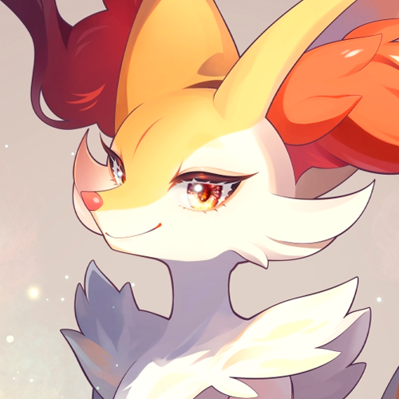

# Brix

Codigo em Python do Bot de interação no discord Brix The Braixen  

Esse codigo foi desenvolvido e aprimorado a partir do [antigo Braixen Atendimento](https://github.com/O-Braixen/Braixen-Atendimento) usando os conhecimentos do curso do Dominado o discord do [Youtuber Dune](https://www.youtube.com/@DuneDiscord) e com muito estudo e suor de um aspirante a desenvolvedor chamado Vincius cuja o sonho é fazer um bot cheio de recursos e com uma personalidade unica para sua comunidade [Braixen's House](https://discord.gg/ZRHwWydQFu) e para todo Mundo!

**Oque Brix pode fazer?**

Brix tem varios comandos desde os mais basicos a soluções personalidadas proprias.

**/ai**

Com o poder do Gemini nas patas de brix, ele pode ir muito além do codigo, ajudando a resumir conversas, criar transcrições de audio, identificar imagens e videos ou simplesmente entregar uma historia sobre um simples graveto, as possibilidades são inumeras, ainda mais com a tecnologia Gemini 2.0 flash disponivel para todos mediante a assinatura premium.

**/aniversario**

Permita que Brix se lembre de todos os aniversariantes de seu servidor em um sistema completamente diferente dos demais bots, enquanto bots como Birthday bot entre outros ficam restritos ao servidor no qual foram configurados, Brix vai além disso, graças ao seu banco de dados ele consegue Globalizar essa função, uma vez cadastrada a data de nascimento, em toda a comunidade onde for habilitado o sistema de notificação de aniversariante que você estiver será lembrado!

**/bc**

Como qualquer outro bot de finanças brix também tem sua propria Moeda particular a BraixenCoin, ou BC, é sua moedinha de ouro própria para transações internas dentro do bot, onde é possivel adquirir itens em suas lojas de /Loja diaria ou /Cores Loja (configurado pelo servidor) fazendo de brix ser o verdadeiro vendedor nato com sua propria moeda.

**/cai**

Character.ai é uma incrivel ferramenta de conversação com personagens via inteligencia artificial, e ela está presente dentro de brix, com uma personalidade unica fazendo ele ser um otimo companheiro e ouvinte para varias conversas sendo possivel ser usado tanto via comando ou mencionando o bot na conversa, recurso disponivel a todos mediante assinatura premium.

**/img**

Brix conta em seu ascenal uma incrivel porém emblematica ferramenta de imagens a E621.api que é capaz de auxilia-lo em exibir imagens de Braixen ou outros pokémon selecionados, além desse recurso também ser usado em um comando automatico de postagem de imagens de braixen/fennekin ou delphox com /autophox.

**/premium**

Gravetos de ouro, uma segunda moeda totalmente exclusiva para adquirir itens unicos em sua loja, esse é um dos varios recursos que Brix disponibiliza a todos que contratam uma assinatura mais avançada, desbloqueando todo o potencial que brix pode oferecer.

**Instruções de instalação**

Caso você rode na Squarecloud (onde esse código foi planejado) basta editar todo o arquivo exemplo.env e ao final deve renomear para apenas .env e compacte tudo e envie para a squarecloud.

Caso queira rodar localmente recomendo o uso do VScode e para instalar os requisitos use *pip install -r requirements.txt* para que o sistema instale todos os requisitos antes de iniciar seu bot.
